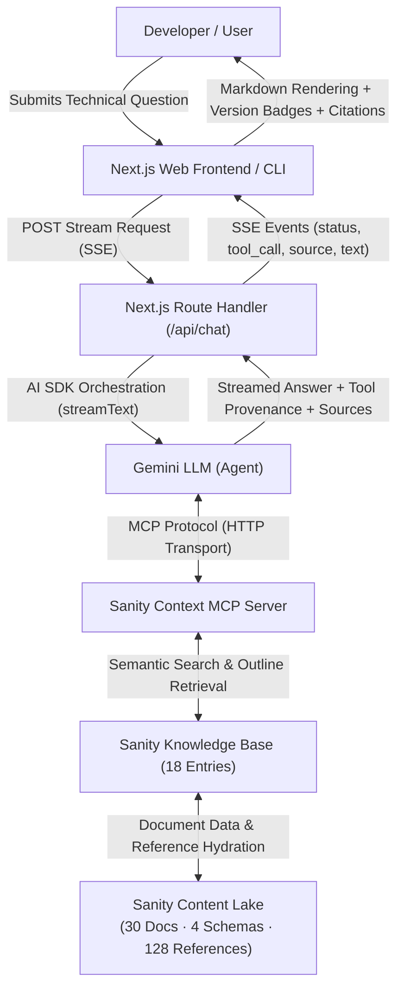

# DevDocs Intelligence

DevDocs Intelligence is a version-aware developer documentation intelligence agent powered by Google Gemini, Sanity structured content, Sanity Knowledge Base, and Sanity Context MCP. Built for the Sanity Challenge 2026, it transforms technical documentation from static text into an interconnected, queryable knowledge graph capable of answering complex, multi-version framework questions about Next.js with grounded citations and live tool provenance.

## Demo

- **Repository**: [https://github.com/affanraza84/devdocs-intelligence](https://github.com/affanraza84/devdocs-intelligence)
- **Deployment**: The production web frontend is built with Next.js and deployed on Vercel, with all LLM and Sanity Context MCP interactions handled through secure server-side streaming routes.
- **Interactive Experience**: Users can run sample framework queries or enter custom questions to see real-time streaming answers, inspect live MCP tool calls (`initial_context`, `knowledge_base_read`), review grounded Sanity document citations, and explore version-specific changes across Next.js 14, 15, and 16.

## What I Built

DevDocs Intelligence is an agentic documentation assistant designed for frontend engineers navigating breaking changes, deprecated conventions, and framework evolution. Rather than treating documentation as flat markdown pages or unindexed text blobs, DevDocs Intelligence treats technical documentation as typed, relational content.

Key distinctions of this approach include:

- **Relational vs. Flat Retrieval**: Traditional documentation search relies on keyword matches or naive chunk embeddings that lack structural awareness. DevDocs Intelligence models APIs, conceptual guides, migrations, and release notes as separate entity types connected by 128 explicit references.
- **Version Discrimination**: The agent distinguishes between behavior in Next.js 14, 15, and 16. It correctly identifies when default behaviors shift (such as caching defaults in Route Handlers or dynamic fetch stale times) and traces the upgrade path through dedicated migration guides.
- **Provenance and Grounding**: Every streamed response links back to authentic Sanity documents, displaying the document type, title, and target version tag.

## Why Sanity?

Standard vector databases flatten rich technical documentation into plain text chunks, stripping away hierarchy, type semantics, and relational context. Sanity provides the foundation that makes reliable agentic retrieval possible:

- **Typed Content**: Clear schema separation ensures that API references, conceptual guides, migration steps, and release notes retain their distinct structures and validation rules.
- **Cross-Document Relationships**: First-class Sanity references (`_type: 'reference'`) link APIs directly to breaking change notices, release changelogs, and architecture guides, enabling multi-hop graph traversal.
- **Sanity Knowledge Base**: The indexed Knowledge Base (`kbU7pqSq7jdK`) provides 100% source span coverage over the curated Next.js corpus, enabling semantic search while retaining structural context.
- **Sanity Context MCP**: Hosted Model Context Protocol (MCP) server endpoints expose retrieval tools directly to the Gemini LLM, allowing the agent to inspect knowledge outlines and read full documents dynamically.
- **Content Operations**: Content updates, version additions, and relationship adjustments can be managed directly through Sanity Studio without retraining or fine-tuning models.

## Architecture

The system coordinates between the Next.js user interface, Gemini generative models, and Sanity hosted services via the Model Context Protocol:



### Architectural Principles:

1. **Server-Side Secret Boundary**: All API keys (`GEMINI_API_KEY`, `SANITY_API_READ_TOKEN`) and MCP endpoints reside exclusively on the server runtime; zero secrets are exposed to the browser.
2. **Standardized Protocol**: Tool execution uses `@ai-sdk/mcp` over HTTP transport to connect directly to the hosted Sanity Context MCP endpoint.
3. **Multi-Step Tool Invocation**: The agent autonomously inspects outlines using `initial_context` and hydrates specific document content using `knowledge_base_read` or `knowledge_base_search`.
4. **Resilient Streaming**: The application streams responses using Server-Sent Events (SSE), streaming text deltas and tool execution metadata while isolating rate limit or demand errors.

## Structured Content Model

The Sanity schema models developer documentation across four specialized document types:

| Content Type         | Purpose                                                                                          | Key Schema Fields                                                                                                                                           | Important Relationships                                                                                                |
| :------------------- | :----------------------------------------------------------------------------------------------- | :---------------------------------------------------------------------------------------------------------------------------------------------------------- | :--------------------------------------------------------------------------------------------------------------------- |
| **`documentation`**  | Conceptual architecture, guides, routing, rendering, caching, data fetching, and error recovery. | `title`, `slug`, `product`, `version`, `category`, `summary`, `content`, `tags`, `sourceTitle`, `sourceUrl`, `lastUpdated`                                  | `relatedApis` (→ `apiReference`), `relatedMigrations` (→ `migrationGuide`)                                             |
| **`apiReference`**   | Signatures, parameters, directives, return types, code examples, and known constraints.          | `name`, `slug`, `product`, `version`, `apiType`, `description`, `parameters`, `example`, `limitations`, `sourceTitle`, `sourceUrl`                          | `relatedDocumentation` (→ `documentation`), `relatedMigrations` (→ `migrationGuide`)                                   |
| **`migrationGuide`** | Version transitions, breaking changes, step-by-step migration procedures, and affected features. | `title`, `slug`, `product`, `fromVersion`, `toVersion`, `summary`, `breakingChanges`, `migrationSteps`, `affectedFeatures`, `sourceTitle`, `sourceUrl`      | `affectedApis` (→ `apiReference`), `relatedDocumentation` (→ `documentation`), `relatedReleaseNotes` (→ `releaseNote`) |
| **`releaseNote`**    | Version announcements, release dates, changelog summaries, breaking changes, and deprecations.   | `title`, `version`, `product`, `releaseDate`, `summary`, `changes`, `breakingChanges`, `deprecatedFeatures`, `affectedFeatures`, `sourceTitle`, `sourceUrl` | `affectedApis` (→ `apiReference`), `relatedDocumentation` (→ `documentation`), `migrationGuides` (→ `migrationGuide`)  |

References between these types establish **128 bidirectional reference links**, allowing the agent to navigate from a high-level guide to an exact API signature and its corresponding migration notes.

## Sanity Knowledge Base

The documentation corpus is indexed within the Sanity Knowledge Base:

- **Target Dataset**: `production` (Sanity Project ID: `0ovd9f2s`)
- **Document Count**: 30 curated documents (12 `documentation`, 9 `apiReference`, 4 `migrationGuide`, 5 `releaseNote`)
- **Knowledge Base ID**: `kbU7pqSq7jdK`
- **Knowledge Base Entries**: 18 structured entries covering core framework domains
- **Source Span Coverage**: 100% source span coverage in the successful Knowledge Base build
- **Retrieval Mechanism**: The Knowledge Base indexes document text and structure, allowing Sanity Context MCP to return concise outlines, entry paths, and content sections with reference links intact.

## How the Agent Works

The agent query workflow executes in eight steps:

1. **User Query**: The developer submits a question via the web interface or CLI.
2. **Analysis**: Gemini analyzes the question and determines the required domain knowledge (e.g., caching defaults, route handling, migration changes).
3. **MCP Handshake**: The agent connects to the Sanity Context MCP endpoint using bearer token authentication over HTTP transport.
4. **Context Discovery**: The agent calls `initial_context` to inspect available knowledge base outlines and discover relevant entry paths.
5. **Targeted Retrieval**: The agent calls `knowledge_base_read` or `knowledge_base_search` to retrieve the relevant document bodies and Portable Text blocks.
6. **Graph Traversal**: When resolving cross-version questions, the agent reads linked documents referenced across `affectedApis`, `relatedMigrations`, and `relatedDocumentation`.
7. **Grounded Synthesis**: Gemini synthesizes a version-aware answer strictly grounded in the retrieved content, avoiding hallucinated APIs or outdated conventions.
8. **UI Streaming & Attribution**: The web interface streams the markdown response in real time, displays live MCP tool invocation badges, and renders source cards linked to the referenced Sanity documents.

## Example Queries

The system has been evaluated on multi-document technical queries:

### 1. Dynamic StaleTime & Caching Defaults

> _"What is the default dynamic staleTime in Next.js 15 and how did it change from previous versions?"_

- **Structured Knowledge Required**: Traverses `documentation` (App Router Caching Architecture), `releaseNote` (Next.js 15.0 GA), and `migrationGuide` (Next.js 14 → 15 Upgrade) to explain that dynamic `staleTime` changed from 30 seconds in Next.js 14 to 0 seconds in Next.js 15 for the Client Router Cache.

### 2. Multi-Version Routing & Proxy Migration

> _"Explain the major routing changes between Next.js 15 and Next.js 16, including params, Route Handlers, and the transition from middleware.ts to proxy.ts."_

- **Structured Knowledge Required**: Requires cross-document synthesis linking `migrationGuide` (Middleware → Proxy Migration), `apiReference` (`proxy.js`, `route.js`), and `documentation` (Proxy Edge Layer, Routing Architecture) to detail the deprecation of `middleware.ts` in favor of `proxy.ts` and asynchronous request handling.

### 3. Route Handler Default Caching

> _"How did Route Handler caching behavior change in Next.js 15?"_

- **Structured Knowledge Required**: Combines `apiReference` (`route.js`), `documentation` (Route Handlers), and `migrationGuide` (Next.js 14 → 15) to describe how GET Route Handlers are no longer cached by default in Next.js 15 unless explicitly configured with `export const dynamic = 'force-static'`.

## Key Features

- **Gemini-Powered Agent**: Powered by Google Gemini (`gemini-2.5-flash` / `gemini-3.8-flash`) via the Vercel AI SDK (`@ai-sdk/google`).
- **Sanity Context MCP Integration**: Native MCP client integration (`@ai-sdk/mcp`) connected to hosted Sanity Context MCP endpoints.
- **Knowledge Base Retrieval**: High-fidelity retrieval over 18 Knowledge Base entries with 100% source span coverage.
- **Structured Content Schemas**: Four purpose-built Sanity schemas enforcing typed fields and portable text blocks.
- **Cross-Document Relationships**: 128 resolved references allowing cross-entity traversal.
- **Version-Aware Answers**: Accurate comparative discrimination across Next.js 14, 15, and 16.
- **Real-Time Streaming**: Chunked SSE streaming with live progress status and tool invocation tracking.
- **Grounded Source Attribution**: UI displays verified citations with document titles, paths, and version tags.
- **Resilient Error Handling**: Specific user-facing recovery messages for rate limits, demand surges, and network timeouts.
- **Server-Side Security**: Full protection of API tokens and endpoints with zero browser credential exposure.

## Tech Stack

| Layer                   | Technologies                                                                                                  |
| :---------------------- | :------------------------------------------------------------------------------------------------------------ |
| **Frontend**            | Next.js (App Router), TypeScript, Tailwind CSS, Lucide React, React Markdown, Remark GFM                      |
| **AI & Agent**          | Google Gemini (`gemini-2.5-flash`, `gemini-3.8-flash`), Vercel AI SDK (`ai`, `@ai-sdk/google`, `@ai-sdk/mcp`) |
| **Content Lake**        | Sanity Studio v3 (`sanity`, `@sanity/structure`, `@sanity/vision`, `@sanity/client`)                          |
| **Retrieval & Context** | Sanity Knowledge Base (`kbU7pqSq7jdK`), Sanity Context MCP                                                    |
| **Deployment**          | Vercel (Web Application), Sanity Managed Cloud (Studio & Content Lake)                                        |

## Project Structure

```text
devdocs-intelligence/
├── docs/
│   └── content-ingestion.md      # Detailed documentation of the ingestion pipeline
├── frontend/                     # Next.js web application
│   ├── app/
│   │   ├── api/
│   │   │   ├── chat/route.ts     # SSE streaming route with MCP agent orchestration
│   │   │   └── health/route.ts   # Agent & MCP health check endpoint
│   │   ├── globals.css           # Tailwind CSS styles and custom styling
│   │   ├── layout.tsx            # Root layout
│   │   └── page.tsx              # Main chat interface page
│   ├── components/
│   │   ├── chat/                 # Chat container, input, messages, tool badges, prompts
│   │   ├── sources/              # Grounded source cards and source drawers
│   │   └── ui/                   # Header and navigational components
│   ├── lib/
│   │   ├── agent/                # Agent streaming logic and TypeScript types
│   │   └── config/               # Server-side environment variable validation
│   ├── package.json              # Frontend dependencies and scripts
│   └── tsconfig.json             # Frontend TypeScript configuration
├── schemaTypes/                  # Sanity Studio schemas
│   ├── apiReference.ts           # API reference schema
│   ├── documentation.ts          # Conceptual documentation schema
│   ├── index.ts                  # Schema registration bundle
│   ├── migrationGuide.ts         # Version migration guide schema
│   └── releaseNote.ts            # Release note schema
├── scripts/
│   ├── data/
│   │   └── corpus.ts             # Curated Next.js documentation corpus (30 documents)
│   ├── ask-agent.ts              # Standalone CLI agent query script
│   └── seed-nextjs.ts            # 4-phase idempotent Sanity seed pipeline
├── src/
│   └── agent/                    # Standalone agent server and configuration
│       ├── agent.ts              # Agent execution logic
│       ├── config.ts             # Environment validation and config
│       ├── sanity-client.ts      # Configured Sanity client instance
│       └── server.ts             # Standalone HTTP agent server
├── .env.example                  # Environment configuration template
├── package.json                  # Root dependencies and Sanity Studio scripts
├── sanity.cli.ts                 # Sanity CLI configuration
├── sanity.config.ts              # Sanity Studio configuration
└── tsconfig.json                 # Studio TypeScript configuration
```

## Getting Started

### 1. Clone Repository

```bash
git clone https://github.com/affanraza84/devdocs-intelligence.git
cd devdocs-intelligence
```

### 2. Configure Environment Variables

Copy `.env.example` in the project root:

```bash
cp .env.example .env
```

And in the `frontend` directory:

```bash
cp frontend/.env.example frontend/.env
```

Fill in the required server-side credentials:

```env
SANITY_API_READ_TOKEN=your_sanity_read_token
SANITY_CONTEXT_MCP_URL=https://api.sanity.io/v1/context/organizations/oyl832pn4/mcp/devdocs-gemini-agent
GEMINI_API_KEY=your_gemini_api_key
```

### 3. Install Dependencies

Install root workspace dependencies (Sanity Studio, agent scripts):

```bash
npm install
```

Install frontend dependencies:

```bash
cd frontend && npm install && cd ..
```

### 4. Run Development Servers

To start the **Sanity Studio** locally (port 3333):

```bash
npm run dev
```

To start the **Next.js Web Frontend** locally (port 3000):

```bash
cd frontend
npm run dev
```

To query the agent directly via the **CLI runner**:

```bash
npm run agent:ask -- "What changed with Route Handlers in Next.js 15?"
```

To run the **standalone agent HTTP server** (port 3001):

```bash
npm run agent:server
```

### 5. Build for Production

To build the Sanity Studio bundle:

```bash
npm run build
```

To build the Next.js web application:

```bash
cd frontend
npm run build
```

## Environment Variables

The following environment variables are utilized across the root project and frontend. All values must remain server-side:

| Variable Name            | Required | Scope            | Purpose                                                                      |
| :----------------------- | :------- | :--------------- | :--------------------------------------------------------------------------- |
| `SANITY_API_READ_TOKEN`  | Yes      | Server           | Bearer token for authenticating with the hosted Sanity Context MCP endpoint. |
| `SANITY_CONTEXT_MCP_URL` | Yes      | Server           | URL endpoint for the hosted Sanity Context MCP service.                      |
| `GEMINI_API_KEY`         | Yes      | Server           | Google Generative AI API key for invoking the Gemini model.                  |
| `SANITY_PROJECT_ID`      | Optional | Studio / Scripts | Sanity project identifier (`0ovd9f2s`).                                      |
| `SANITY_DATASET`         | Optional | Studio / Scripts | Target dataset (`production`).                                               |
| `SANITY_API_VERSION`     | Optional | Studio / Scripts | Sanity API version date (`2026-01-01`).                                      |
| `SANITY_WRITE_TOKEN`     | Optional | Seed Pipeline    | API token with write permissions for seeding corpus data.                    |
| `GEMINI_MODEL`           | Optional | Server           | Target Gemini model identifier (defaults to `gemini-3.8-flash`).             |
| `PORT`                   | Optional | Agent Server     | Port for the standalone agent server (defaults to `3001`).                   |

_Note: None of these variables should be prefixed with `NEXT_PUBLIC_`._

## Sanity Setup

- **Project ID**: `0ovd9f2s`
- **Dataset**: `production`

### Seeding the Corpus

The repository contains an idempotent, 4-phase seed script that populates the Sanity Content Lake with the curated Next.js corpus:

```bash
npm run seed:nextjs
```

The pipeline executes through:

1. **Phase A (Base Ingestion)**: Creates/replaces 30 base documents with rich Portable Text and metadata.
2. **Phase B (ID Mapping)**: Constructs in-memory routing tables from deterministic slugs and IDs.
3. **Phase C (Relationship Patching)**: Resolves and commits 128 cross-document references.
4. **Phase D (Dataset Verification)**: Queries GROQ counts and verifies sample reference hydration.

## Testing & Verification

The repository implementation has undergone verification:

- **TypeScript Validation**: Zero type errors across root and frontend workspaces (`npx tsc --noEmit` and `npm run typecheck` in `frontend/`).
- **Production Builds**: Clean production builds verified for both Sanity Studio (`sanity build`) and Next.js frontend (`next build`).
- **MCP Integration Testing**: Direct tool communication verified over HTTP transport to the hosted Sanity Context MCP server with authenticated bearer tokens.
- **Streaming Response Behavior**: Verified real-time chunked transfer using Server-Sent Events (`/api/chat`) and CLI streaming (`scripts/ask-agent.ts`).
- **Grounded Source Attribution**: Verified extraction and rendering of citation metadata from `knowledge_base_read` tool invocations.
- **Error Handling**: Handled edge conditions including Gemini 429 rate limit errors, 503 upstream demand surges, and network timeouts with user-friendly recovery prompts.
- **Security Check**: Verified that no secrets or API keys are bundled into static assets or sent in client payloads.

## Sanity Challenge

This project was built for the **DEV Community Sanity Challenge 2026** under **Path One: "Ship an agent that queries real content."**

It demonstrates how Sanity fulfills the requirements of real-world agentic retrieval:

- **Real Content in Sanity**: 30 comprehensive documents covering the architecture and evolution of Next.js 14, 15, and 16.
- **Structured Content Types**: Four distinct schemas (`documentation`, `apiReference`, `migrationGuide`, `releaseNote`) modeling technical information with semantic fidelity.
- **Sanity Knowledge Base**: 18 Knowledge Base entries with 100% source span coverage.
- **Sanity Context MCP**: Hosted MCP integration serving as the direct bridge between Gemini and Sanity content.
- **Grounded Multi-Document Answers**: Demonstrates knowledge synthesis and reference traversal rather than naive text matching.

## Future Improvements

- **Automatic Webhook Synchronization**: Trigger automated Knowledge Base re-indexing when documents are published or updated in Sanity Studio.
- **Interactive Graph Visualizer**: Render an interactive graph visualization of traversed references directly within the web interface.
- **Multi-Framework Corpus**: Expand the schema and corpus to index adjacent ecosystems such as React 19 and Sanity Studio v3 APIs.
- **Inline Citation Highlighting**: Highlight exact matching text spans within Portable Text blocks directly inside the source cards.

## License

This project is marked as `UNLICENSED` in `package.json` (Private / All Rights Reserved).
