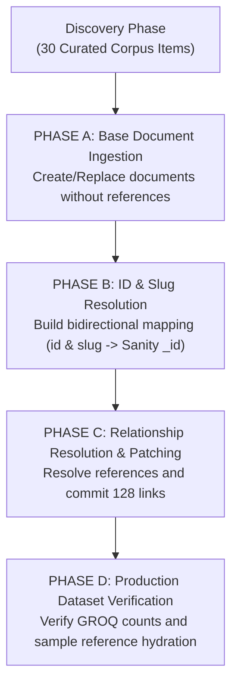
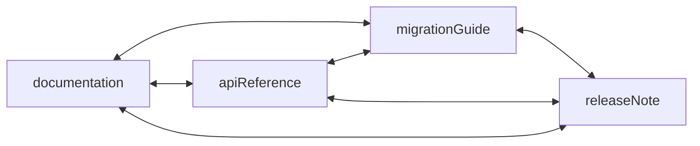

# Next.js Curated Content Ingestion Pipeline

This document outlines the reproducible data-ingestion pipeline developed for **DevDocs Intelligence** as part of the **DEV Community Sanity Challenge Path One: "Ship an agent that queries real content."**

---

## 1. Overview & Source Corpus

The dataset is populated with a curated, high-fidelity corpus derived exclusively from the official **Next.js Documentation** ([https://nextjs.org/docs](https://nextjs.org/docs)) and official release notes ([https://nextjs.org/blog](https://nextjs.org/blog)).

The corpus is curated to support an AI agent performing:
- **Semantic Retrieval**: Technical descriptions, limitations, and code patterns formatted in Portable Text.
- **Document-Type Awareness**: Structured discrimination across conceptual documentation, API references, migration guides, and release notes.
- **Version Awareness**: Clear separation and explicit tracking across Next.js 14, 15, and 16, and React 19 compatibility.
- **Dense Cross-Document Graph Reasoning**: Rich references connecting features to their API signatures, breaking changes, migration steps, and release notes.

---

## 2. Document Types & Distribution

The corpus consists of **30 curated documents** across the four registered Sanity schema types:

| Document Type | Count | Focus Areas | Key Topics Covered |
| :--- | :--- | :--- | :--- |
| **`documentation`** | 12 | Architecture, Routing, Rendering, Caching, and Error Recovery | App Router architecture, Project structure & conventions, Layouts & pages, Client navigation & prefetching, Server/Client component composition, Data fetching & Server Actions, Loading UI & streaming, Error boundaries, Route Handlers, Proxy edge layer, Caching architecture, and Revalidation (ISR). |
| **`apiReference`** | 9 | Core Functions, Directives, and Conventions | `'use client'`, `'use server'`, `revalidatePath`, `route.js` (Route Handlers), `proxy.js` (Proxy convention), `generateMetadata`, `redirect`, `notFound`, and `cookies()`. |
| **`migrationGuide`** | 4 | Real Version Transitions & Breaking Changes | Next.js 14 → 15 upgrade, Next.js 15 → 16 upgrade, Middleware → Proxy migration, and Synchronous to Asynchronous Request APIs (`cookies()`, `headers()`, `params`). |
| **`releaseNote`** | 5 | Version-Specific Releases & Feature Summaries | Next.js 15.0 GA, Next.js 15.1, Next.js 15.2, Next.js 16.0, and React 19 Integration. |

---

## 3. Ingestion Architecture

The ingestion pipeline (`scripts/seed-nextjs.ts`) runs through a 4-phase idempotent lifecycle:



### Phase A: Base Documents Ingestion
All documents are created using Sanity's `client.createOrReplace()` with all required content, Portable Text blocks, parameters, and metadata—**excluding** reference arrays. This eliminates race conditions or unresolved reference errors.

### Phase B: Identifier & Slug Resolution
An in-memory routing map is constructed mapping both deterministic IDs (`doc-caching`) and slugs (`caching-architecture-and-defaults`) to their target Sanity document IDs.

### Phase C: Cross-Document Relationship Patching
For every document declaring relationships, target identifiers are resolved and compiled into Sanity reference arrays (`{ _type: 'reference', _ref: targetDocId, _key: '...' }`). These are committed to Sanity using `client.patch(docId).set(...).commit()`.

### Phase D: Dataset Verification
A GROQ query verifies document counts per type, checks total records in the dataset, and performs sample deep-reference hydration.

---

## 4. Deterministic IDs & Idempotency

To prevent uncontrolled duplicate documents, each document has a stable, deterministic identifier:
- Documentation: `doc-[topic]` (e.g., `doc-app-router`, `doc-caching`, `doc-proxy`)
- API References: `api-[name]` (e.g., `api-use-client`, `api-revalidate-path`, `api-cookies`)
- Migration Guides: `mig-[transition]` (e.g., `mig-14-to-15`, `mig-middleware-to-proxy`)
- Release Notes: `rel-[version]` (e.g., `rel-nextjs-15-0`, `rel-nextjs-16-0`)

Running the script multiple times safely updates existing records in place without duplicating documents or corrupting relationships.

---

## 5. Relationship Network

The seed pipeline populates references across all 4 document types, establishing **128 bidirectional reference links**:



- `documentation.relatedApis` → references `apiReference`
- `documentation.relatedMigrations` → references `migrationGuide`
- `apiReference.relatedDocumentation` → references `documentation`
- `apiReference.relatedMigrations` → references `migrationGuide`
- `migrationGuide.affectedApis` → references `apiReference`
- `migrationGuide.relatedDocumentation` → references `documentation`
- `migrationGuide.relatedReleaseNotes` → references `releaseNote`
- `releaseNote.affectedApis` → references `apiReference`
- `releaseNote.relatedDocumentation` → references `documentation`
- `releaseNote.migrationGuides` → references `migrationGuide`

---

## 6. Environment Variables

The ingestion pipeline respects zero-hardcoded-secret practices. Configuration is read via environment variables:

| Variable | Description | Example |
| :--- | :--- | :--- |
| `SANITY_PROJECT_ID` | Sanity Project ID | `0ovd9f2s` |
| `SANITY_DATASET` | Target dataset | `production` |
| `SANITY_API_VERSION` | Sanity API version date | `2026-01-01` |
| `SANITY_WRITE_TOKEN` | Sanity API Write token (Editor or Admin) | *(Kept secret)* |

See `.env.example` for the environment template.

> **Local Fallback:** When running in an environment where the local Sanity CLI is already authenticated (via `~/.config/sanity/config.json`), the script will automatically and safely fall back to the active CLI session if `SANITY_WRITE_TOKEN` is not explicitly set in `.env`.

---

## 7. How to Run the Seed Pipeline

From the `devdocs-intelligence` project directory:

```bash
# Run TypeScript compilation check
npm run build # or npx tsc --noEmit

# Execute the seed ingestion script
npm run seed:nextjs
```

---

## 8. Verifying the Imported Content

### Method 1: GROQ Query via Sanity Vision / CLI
Run the following GROQ query in Sanity Vision tool (`/vision`) or via CLI:

```groq
{
  "documentation": count(*[_type == "documentation"]),
  "apiReference": count(*[_type == "apiReference"]),
  "migrationGuide": count(*[_type == "migrationGuide"]),
  "releaseNote": count(*[_type == "releaseNote"]),
  "total": count(*[_type in ["documentation", "apiReference", "migrationGuide", "releaseNote"]])
}
```

**Expected Result:**
```json
{
  "apiReference": 9,
  "documentation": 12,
  "migrationGuide": 4,
  "releaseNote": 5,
  "total": 30
}
```

### Method 2: Testing Multi-Document Relationship Traversal
Query a migration guide and its linked APIs, docs, and release notes:

```groq
*[_type == "migrationGuide" && slug.current == "upgrade-nextjs-14-to-15"][0]{
  title,
  fromVersion,
  toVersion,
  "affectedApis": affectedApis[]->name,
  "relatedDocs": relatedDocumentation[]->title,
  "relatedReleaseNotes": relatedReleaseNotes[]->title
}
```

**Expected Result:**
```json
{
  "title": "Upgrading from Next.js 14 to Next.js 15",
  "fromVersion": "14.x",
  "toVersion": "15.x",
  "affectedApis": [
    "cookies()",
    "route.js / Route Handlers",
    "revalidatePath"
  ],
  "relatedDocs": [
    "Next.js Caching Architecture and Multi-Tier Cache Invalidation",
    "Data Fetching Strategies and Server Actions",
    "App Router Routing Architecture and Conventions"
  ],
  "relatedReleaseNotes": [
    "Next.js 15.0 Release",
    "React 19 Integration and Architecture in Next.js"
  ]
}
```

### Method 3: Visual Inspection in Sanity Studio
Start the studio locally:
```bash
npm run dev
```
Open [http://localhost:3333](http://localhost:3333) and browse through:
- **Documentation**: Verify titles, rich portable text, categories, source metadata, and related references.
- **API Reference**: Verify parameters, code examples, limitations, and relationships.
- **Migration Guide**: Verify breaking changes, step-by-step guidance, and affected APIs.
- **Release Note**: Verify release dates, change logs, and linked migration guides.
